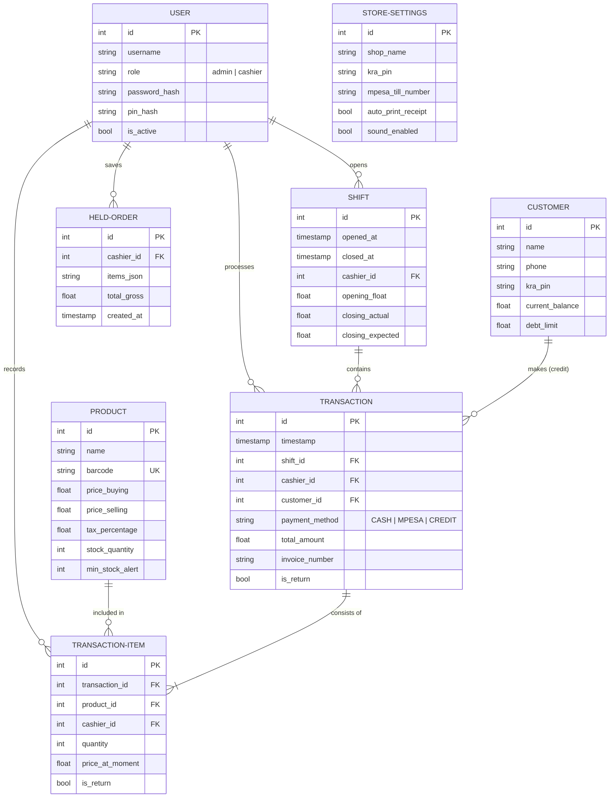

# Database Architecture

DukaPOS uses SQLite (managed via SQLModel/SQLAlchemy) for its data layer. The schema is optimized for offline reliability, performance, and clear audit trails for cashier shifts and transactions.

## Entity Relationship Diagram

## Core Management Strategies

1.  **Concurrency**: SQLite is configured with `check_same_thread=False` and a thread-safe session factory to handle concurrent Electron/Backend requests.
2.  **Versioning**: Database migrations are handled automatically on system startup to ensure the schema matches the latest application version.
3.  **Integrity**: Foreign key constraints are enforced to ensure that transactions and shifts always refer to valid users and products.
